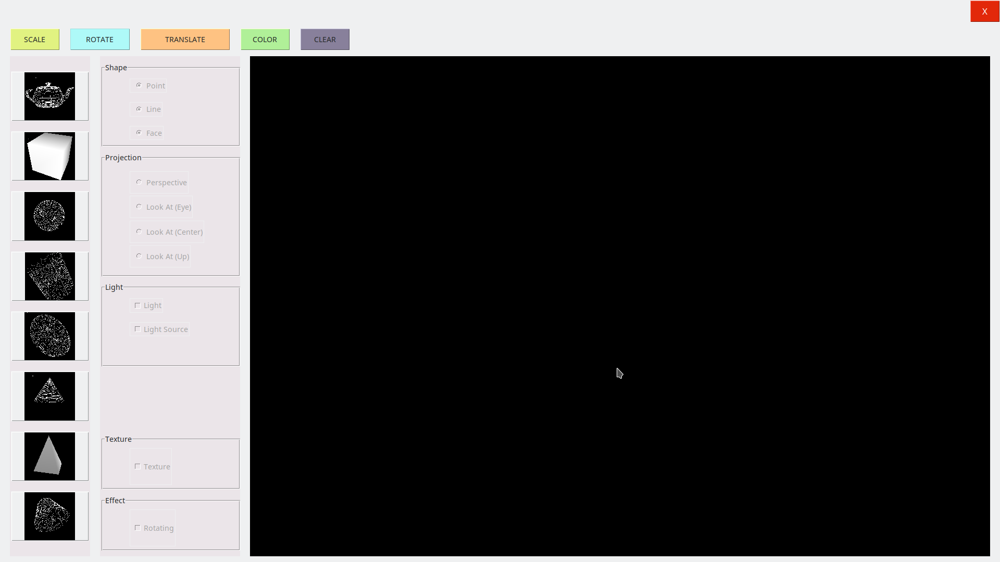

# Draw objects 3d

This is a tool for draw some 3d object.



## Environment
    OS: ubuntu (tested), linux (maybe).
    Python: >=3.0.

## Getting Started

These instructions will help you to run and build this project.


### Buld from source

#### Prerequisites

You need to install all library in requirements.txt and some library for opengl of ubuntu by run 
```shell
chmod +x setup.sh && ./setup.sh
```


After install requirements you and run 
```shell
python3 GUI_app.py
```

### Run execute
You can run execute file `GUI_app` in `dist` folder by 
```shell
chmod +x GUI_app && ./GUI_app
``` 

## Built With

* [tkinter](https://docs.python.org/3/library/tkinter.html) - The standard Python interface to the Tk GUI toolkit
* [PyOpenGL](https://pypi.org/project/PyOpenGL/) - Standard OpenGL bindings for Python

## Authors

* **17520941** - [FanKuan44](https://github.com/FanKuan44)
* **17520960** - [quyvsquy](https://github.com/quyvsquy)
* **17521055** - [thanhpc2001](https://github.com/thanhpc2001)